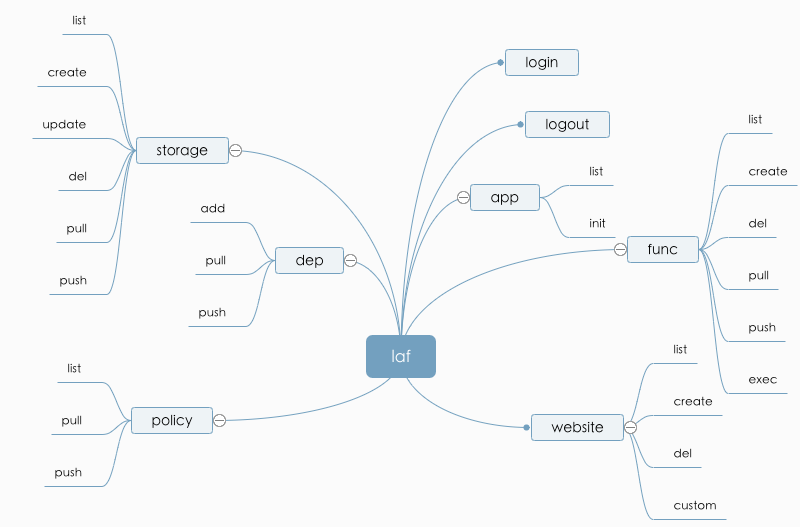

# {{ $frontmatter.title }}


## 简介

`laf-cli` 可以让你实现本地开发同步 Web 端，用你最熟悉的开发工具，更加高效。     

我们先预览一下 cli 为我们提供的所有操作。   


## 安装

```
# 要求  node 版本 >= 16
npm i laf-cli -g
```
cli 的主要功能就是把在 laf web 上的操作集成到命令行里，下面我们根据 web 端的操作来一个个演示。


## 登录
想要执行登录操作我们需要先拿到我们的 PAT（访问凭证）。


生成 token 之后我们复制放在 laf login 后面执行此命令即可登录。
```
laf login [pat]
```
默认登录 `laf.run`，如果要登录私有部署的 laf 可通过 `-r` 参数指定：
  
`laf login [pat] -r https://api.laf.run`
::: tip
这里要注意，https 后面需要加上 api
:::

### 退出登录

```
laf logout
```

## App 
在 web 端登录之后我们会看到我们的 app 列表，那么在 cli 中想查看 app 列表只需要执行。
```
laf app list
```
### 初始化 app 
初始化需要用到 appid ，我们可以在 web 端首页拿到。  
这里稍微解释一下，初始化 app 是指在你运行这个命令的目录下生成模版文件，默认是空的，如果想把 web 端的东西同步过来需要加上 -s 。   
::: tip
建议在一个空的目录下尝试此命令。
:::
```
laf app init [appid]
```

## 依赖

我们可以通过 pull 命令把 web 端的依赖拉到本地，然后 npm i 即可。
```
laf dep pull
```
如果我们想添加依赖可以使用 add ，注意这里的 add 是在 web 端和本地同时添加这个依赖，添加之后 npm i 即可使用。
```
laf dep add [dependencyName]
```
如果我们的依赖文件，或者说整个本地文件都是从其他地方拷贝过来的，可以通过 push 命令把 dependency.yaml 文件中的所有依赖都安装到 web 端。
```
laf dep push
```


## 云函数 
新建云函数，此命令是在本地和 web 同时创建云函数。
```
 laf func create [funcName]
```
删除云函数，同新建一样本地和 web 同时删除。
```
laf func del [funcName]
``` 
查看云函数列表。
```
laf func list
```
更新 web 端云函数代码到本地。
```
laf func pull [funcName] 
```
推送本地云函数代码到 web 。
```
laf func push [funcName] 
```
执行云函数，执行结果会打印在命令行，日志需要在 web 上查看。
```
laf func exec [funcName]
```

## 存储

查看 bucket 列表。
```
laf storage list
```

新建 bucket 。
```
laf storage create [bucketName]
```

删除 bucket 。
```
laf storage del [bucketName]
```

更新 bucket 权限。
```
laf storage update [bucketName]
```

下载 bucket 文件到本地。
```
laf storage pull [bucketName] [outPath]
```

上传本地文件到 bucket 。
```
laf storage push [bucketName] [inPath]
```

## 访问策略

查看所有访问策略。
```
laf policy list
```

拉取访问策略到本地，参数 policyName 是可选，不填代表拉取全部。
```
laf policy pull [policyName] 
```

推送访问策略到 web，参数 policyName 是可选，不填代表推送全部。
```
laf policy push [policyName]
```

## 网站托管
查看托管列表。
```
laf website list
```

开启网站托管，此命令是开启 [bucketName] 的网站托管。
```
laf website create [bucketName]
```

关闭网站托管，此命令是关闭 [bucketName] 的网站托管。
```
laf website del [bucketName]
```

自定义域名，此命令是为已开启网站托管的 [bucketName] 设置自定义域名。
```
laf website custom [bucketName] [domain]
```